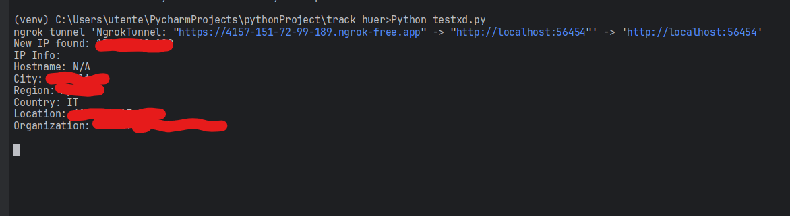

# IP-logger-and-tracker
Simple ip logger made in python using port forwarding with ngrok. IP Geolocator included thanks to ip info api.

# 💻 Code
This simple program uses ngrok port forwarding to establish a simple https tunnel. You can customize the http page for example to make it a phishing website or anything you want. The code then grabs the ip of whoever visits the page and sends an api request to [ip info api](https://ipinfo.io/) in order to get as many informations as possible about the ip, those informations are then displayed.

You can choose to redirect the user to any website, i set up some lines of code to redirect users to a funny gif and commented them. Make sure that only one between the 2 responses are uncommented (im talking about the 200, simple html, and the 302, redirect response), or else there might be issues, you can even decide to use both but adding delays and modifying some stuff.

